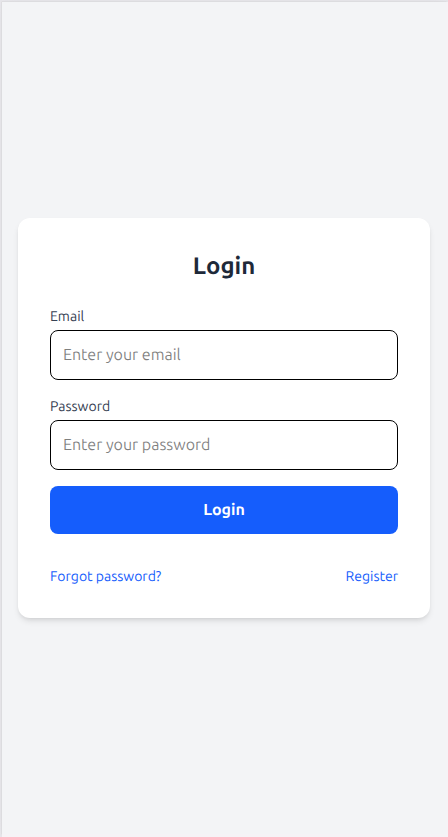
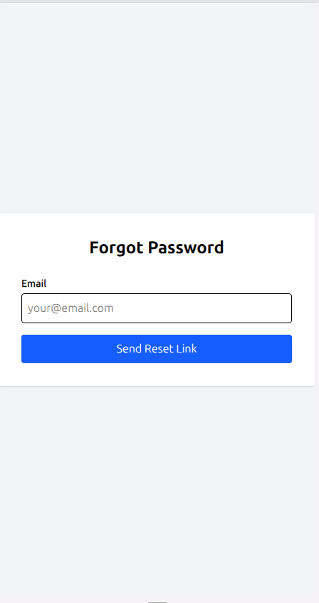
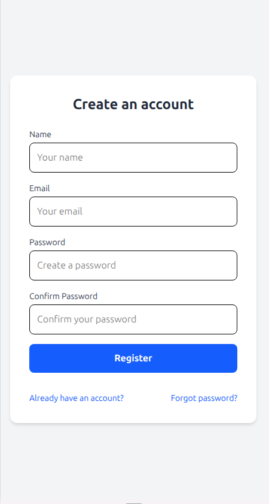
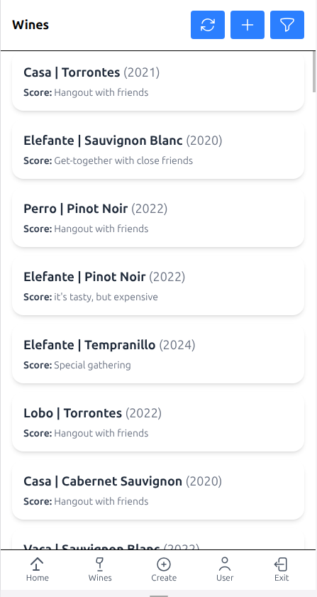
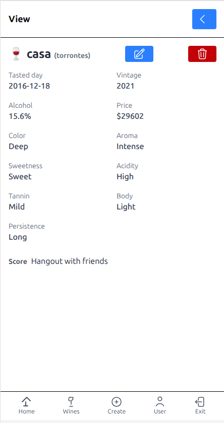
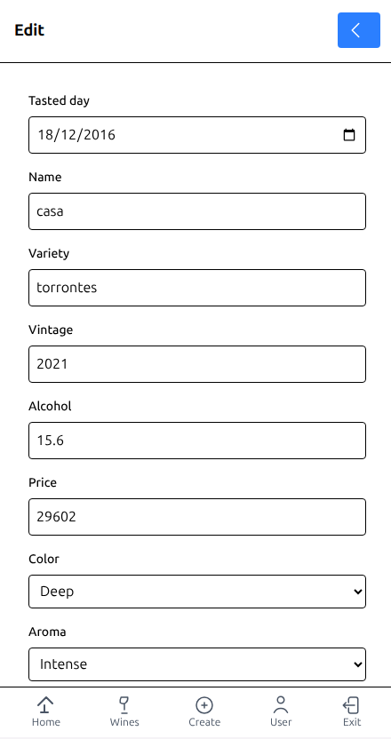
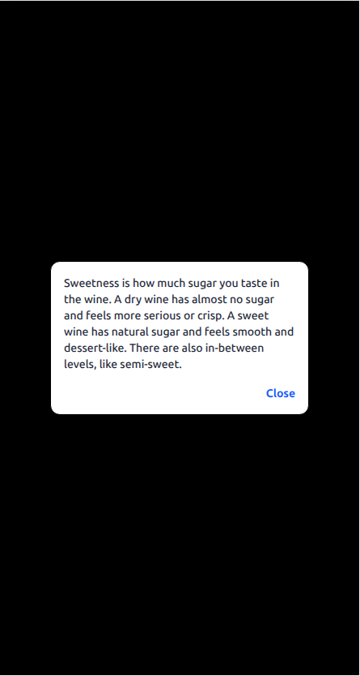
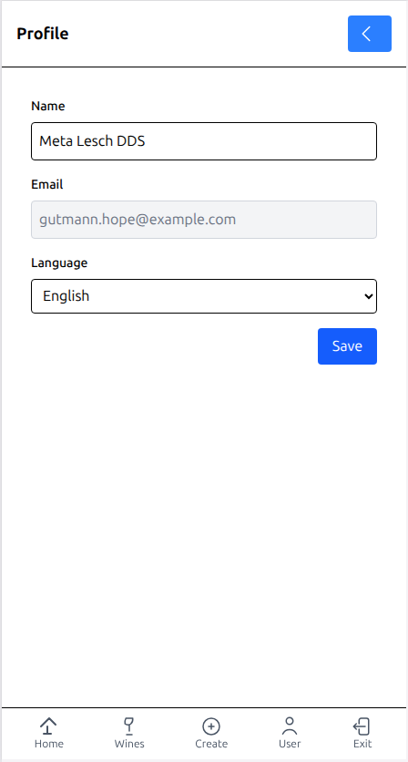

# 🍷 Wine App Frontend

Frontend for the Wine App built with **Vue 3**, **Pinia**, **Vite**, and **TailwindCSS**.\
This SPA (Single Page Application) allows users to add, edit, and manage their wine collection, fully integrated with a Laravel API backend.

🔗 **Frontend repository:** [wine-vue-app](https://github.com/guduchango/wine-vue-app)\
🔗 **Backend repository:** [wine-laravel-app](https://github.com/guduchango/wine-laravel-app)\
🌐 **My website:** [edgardoponce.com](https://edgardoponce.com)

---

## 📦 What does this project include?

✅ Vue 3 with Composition API\
✅ Pinia for state management\
✅ TailwindCSS for styling\
✅ Vite for lightning-fast development\
✅ CRUD for wines: name, country, vintage, variety, winery\
✅ Filtering and searching wines\
✅ Responsive design for mobile and desktop\
✅ Integrated with Laravel API backend

---

## 🚀 How to start the frontend project

1. Clone the frontend repository:

   ```bash
   git clone https://github.com/guduchango/wine-vue-app.git
   cd wine-vue-app
   ```

2. Install dependencies:

   ```bash
   npm install
   ```

3. Run the development server:

   ```bash
   npm run dev
   ```

The app will be available at: [http://localhost:5173](http://localhost:5173)

---

## 🗂 Frontend folder structure

```
wine-vue-app/
├── src/
│   ├── assets/            Images and static assets
│   ├── components/        Reusable Vue components
│   ├── views/             Main application views
│   ├── stores/            Pinia state management
│   ├── router.js          Vue Router config
│   ├── App.vue            Main app component
│   └── main.js            Entry point
├── public/                Static files
├── index.html             Root HTML file
└── vite.config.js         Vite configuration
```

---

## 📸 Screenshots

Add your screenshots inside a `/docs/` folder in the repo and reference them like this:

### 🔑 Auth Screen

<p align="center">
  
</p>

<p align="center">
  
</p>

<p align="center">
  
</p>

---

### 🍷 Wine

<p align="center">
  
</p>

<p align="center">
  
</p>

<p align="center">
  
</p>

<p align="center">
  
</p>


---

### ✏️ Profile

<p align="center">
  
</p>

---

## 🎨 Technologies Used

- Vue 3
- Pinia
- TailwindCSS
- Vite

---

## 🎯 How to contribute

1. Fork the repo
2. Create your branch: `git checkout -b feature/my-feature`
3. Commit your changes: `git commit -m "Add my feature"`
4. Push to your fork: `git push origin feature/my-feature`
5. Open a pull request

Contact: [edgardoponce.com](https://edgardoponce.com) or open an issue.

---

## 📄 License

This project is licensed under the MIT License.

---
